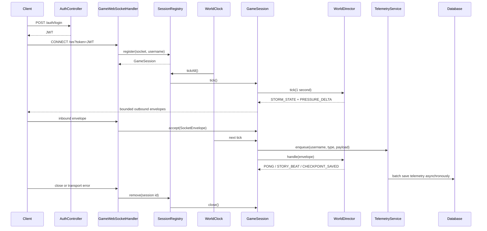

# WebSocket flow

```mermaid
sequenceDiagram
    participant U as Client
    participant A as AuthController
    participant H as GameWebSocketHandler
    participant R as SessionRegistry
    participant C as WorldClock
    participant S as GameSession
    participant D as WorldDirector
    participant T as TelemetryService
    participant DB as Database

    U->>A: POST /auth/login
    A-->>U: JWT
    U->>H: CONNECT /ws?token=JWT
    H->>R: register(socket, username)
    R-->>H: GameSession
    C->>R: tickAll()
    R->>S: tick()
    S->>D: tick(1 second)
    D-->>S: STORM_STATE + PRESSURE_DELTA
    S-->>U: bounded outbound envelopes
    U->>H: inbound envelope
    H->>S: accept(SocketEnvelope)
    C->>S: next tick
    S->>T: enqueue(username, type, payload)
    S->>D: handle(envelope)
    D-->>S: PONG / STORY_BEAT / CHECKPOINT_SAVED
    T->>DB: batch save telemetry asynchronously
    U->>H: close or transport error
    H->>R: remove(session id)
    R->>S: close()
```

The world clock is a single daemon platform thread. The sender for each session
is a separate virtual-thread task; it is the only task that calls
`WebSocketSession.sendMessage`.
